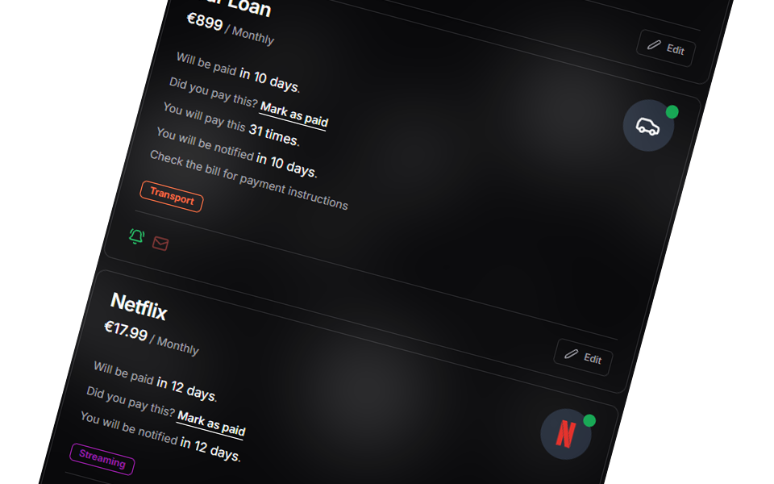
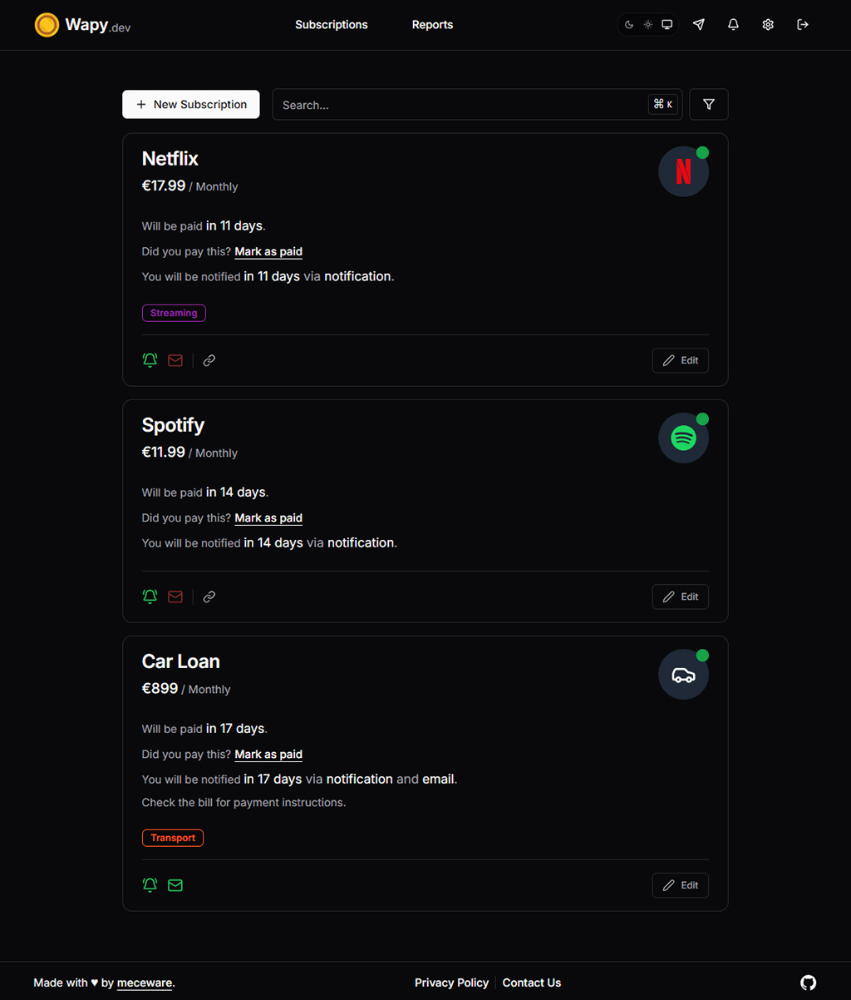
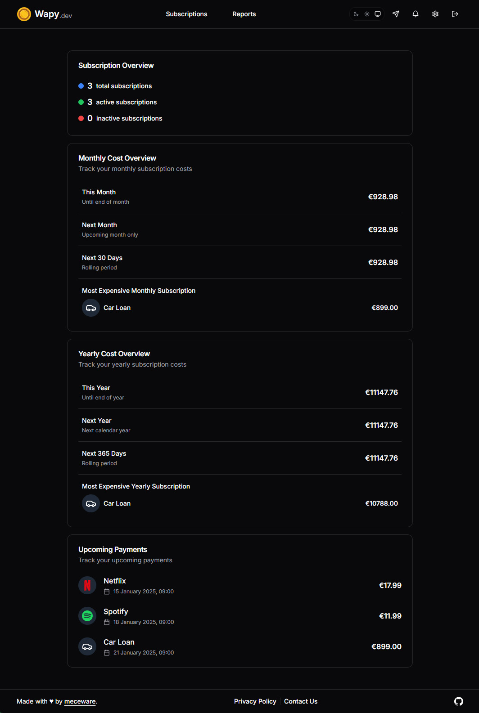
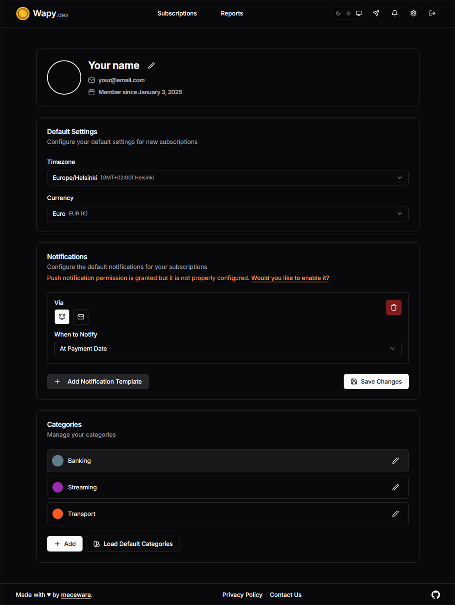

<div align="center">
  
  <h1><strong><a href="https://www.wapy.dev" target="_blank">Wapy.dev</a></strong></h1>
  <h2><strong>Your ultimate subscription management tool</strong></h2>
  
</div>

Wapy.dev is a subscription management platform that helps you track and manage your recurring payments and expenses. Get notified via email or push notifications when payments are due, mark subscriptions as paid, and keep track of your spending across different categories.


## ✨ Key Features

✅ **Track Recurring Subscriptions & Expenses**

Easily log all your subscriptions and payments, so you’ll never miss a due date.

🔔 **Email & Push Notifications**

Get timely reminders when payments are due. Customize notification schedules to fit your needs.

💱 **Multi-Currency & Timezone Support**

Perfect for managing subscriptions in different currencies and time zones.

📜 **Easily Mark Payments as Paid**

Keep track of what’s been paid and review your spending habits over time.

🔐 **Easy Login Options**

Sign in with Email, Github, or Google for a seamless experience.

🎨 **Category Management with Custom Colors**

Organize your subscriptions by category and add a personal touch with custom colors.

📱 **Add to Home Screen for Mobile App Experience**

Use Wapy.dev like a mobile app by adding it to your home screen with just a few taps.

🐳 **Production-Ready with Docker**

Easily self-host Wapy.dev with Docker for a quick and hassle-free installation process.

## Screenshots

Home screen that lists all your subscriptions and expenses, with the ability to filter by category or search for specific items.



Reports page that shows your spending across different times and categories.



Account page where you can manage your profile, notifications and categories.



## Tech Stack

- [Next.js](https://nextjs.org/) for the frontend and API routes
- [PostgreSQL](https://www.postgresql.org/) database with [Prisma ORM](https://www.prisma.io/)
- [Docker](https://www.docker.com/) for containerization
- [Tailwind](https://tailwindcss.com/) for styling
- [shadcn/ui](https://ui.shadcn.com/) components ([Radix UI](https://www.radix-ui.com/) under the hood)
- Authentication with [Auth.js](https://authjs.dev/)
- [Web Push API](https://developer.mozilla.org/en-US/docs/Web/API/Web_Push_API) for notifications
- [Resend](https://resend.com/) for transactional emails
- [Lucide](https://lucide.dev/) and [Simple Icons](https://simpleicons.org/) for icons

## Getting Started

1. Clone the repository

1. On first run, you need to setup the environment variables. Please take a look
at the `.env.example` file to see what variables you need to set.

    - The setup script will copy `.env.example` to `.env` and generate some of the
environment variables automatically. To automatically generate the `.env` file, you can run the `setup.sh` script via following commands:

    ```bash
    # On Linux
    chmod +x ./scripts/setup.sh && ./scripts/setup.sh
    # or
    docker run --rm -v $(pwd):/app -w /app node:23.5-alpine sh -c "apk add --no-cache openssl su-exec && su-exec $(id -u):$(id -g) ./scripts/setup.sh"

    # On Windows
    docker run --rm -v ${PWD}:/app -w /app node:23.5-alpine sh -c "apk add --no-cache openssl && ./scripts/setup.sh"
    ```

    - Configure authentication keys (Github and Google) and Resend API key in the `.env` file.

      - Github and Google OAuth keys (ID and Secret) are for enabling social login.

      - Resend API key (`RESEND_API_KEY`) is for handling authentication emails and email notifications.

1. Run `docker compose -p wapydev up -d` to start the database and server. Default environment is `production`, but you can change it to `development` if you want to, via `NODE_ENV` variable in the `.env` file.

1. Visit `http://localhost:3000` or your domain URL.

### Database Backup and Restore

You can backup the database by running the `backup.sh` script.

```bash
./scripts/backup.sh
```

You can restore the database by running the `restore.sh` script.

```bash
./scripts/restore.sh
```

## Contributing

Contributions are welcome! Please feel free to submit a PR or create an issue.
