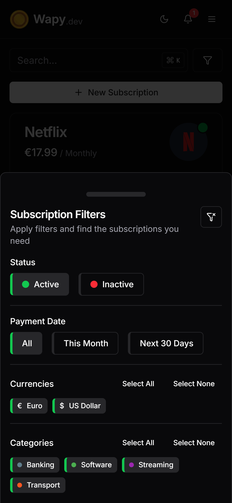
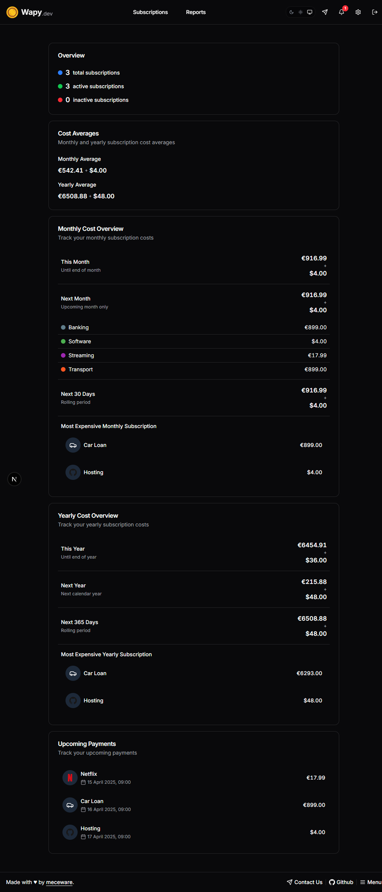
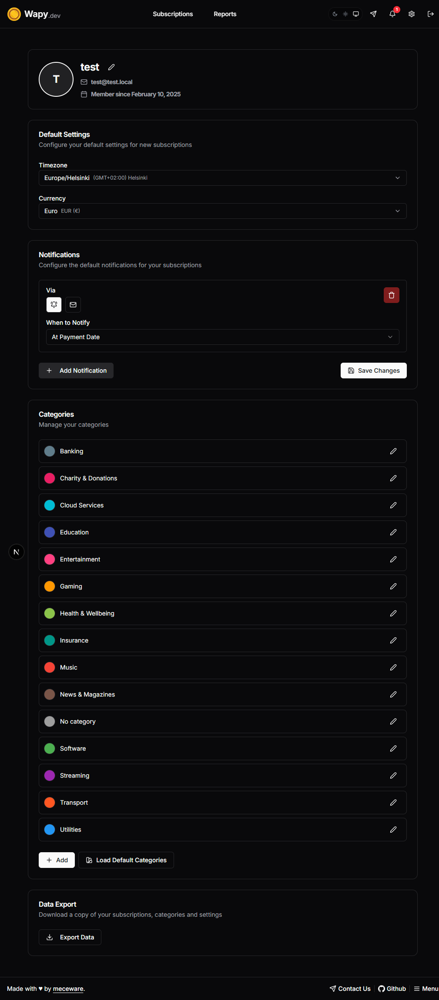
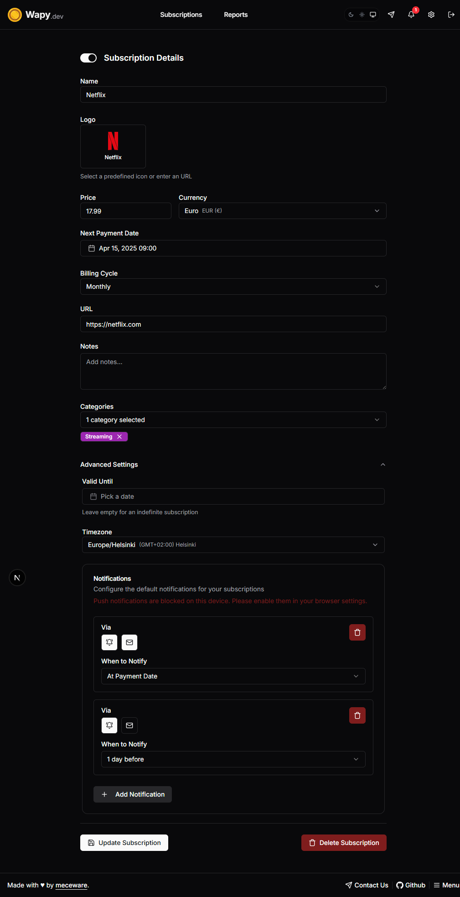
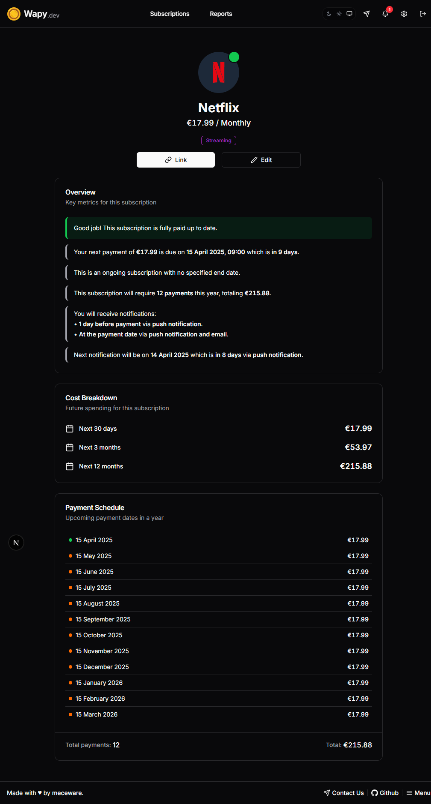

  
  <h1><strong><a href="https://www.wapy.dev" target="_blank">Wapy.dev</a></strong></h1>
  <h2><strong>Smart Subscription Management Made Easy</strong></h2>
  

Wapy.dev is a subscription management platform that helps you track subscriptions, monitor recurring expenses, and get payment reminders in one powerful and human readable dashboard. Get notified via email or push notifications when payments are due, mark subscriptions as paid, and keep track of your spending across different categories.

## ✨ Key Features

✅ **Track Recurring Subscriptions & Expenses**

Easily log all your subscriptions and payments, so you’ll never miss a due date.

🔔 **Email & Push & WebHook Notifications**

Get timely reminders when payments are due. Customize notification schedules to fit your needs.

📊 **Detailed Analytics and Insights**

Get a better understanding of your expenses with detailed reports.

💱 **Multi-Currency & Timezone Support**

Perfect for managing subscriptions in different currencies and time zones.

📜 **Easily Mark Payments as Paid**

Keep track of what’s been paid and review your spending habits over time.

🔐 **Easy Login Options**

Sign in with Email, Github, or Google for a seamless experience.

🎨 **Category Management with Custom Colors**

Organize your subscriptions by category and add a personal touch with custom colors.

💳 **Payment Method Flexibility**

Easily assign payment methods to your subscriptions and display them clearly with recognizable icons.

📱 **Add to Home Screen for Mobile App Experience**

Use Wapy.dev like a mobile app by adding it to your home screen with just a few taps.

🐳 **Production-Ready with Docker**

Easily self-host Wapy.dev with Docker for a quick and hassle-free installation process.

🌗 **Fully Responsive with Light/Dark Mode**

Enjoy a seamless experience on any device with full responsiveness and support for both light and dark modes.

## Screenshots

| **Home Screen**                                                                 | **Filters**                                                             |
|---------------------------------------------------------------------------------|--------------------------------------------------------------------------------|
| Home screen that lists all your subscriptions and expenses.                     | With the ability to filter by category or search for specific items.          |
|  |  |

| **Reports Page**                                                                | **Account Page**                                                              |
|---------------------------------------------------------------------------------|--------------------------------------------------------------------------------|
| Reports page that shows your spending across different times and categories.    | Account page where you can manage your profile, default notifications, and categories. |
|  |  |

| **Edit Page**                                                                   | **View Subscription Page**                                                    |
|---------------------------------------------------------------------------------|--------------------------------------------------------------------------------|
| Edit page for modifying subscription details.                                   | View subscription page for detailed information.                              |
|    |  |

## Getting Started

Ready to get started? Follow [these steps](https://github.com/meceware/wapy.dev/wiki/Getting-Started).

### Environment Variables

The `.env` file is used to configure the application. Please see [Environment Variables](https://github.com/meceware/wapy.dev/wiki/Environment-Variables) for more information.

## Tech Stack

- [Next.js](https://nextjs.org/) for the frontend and API routes
- [PostgreSQL](https://www.postgresql.org/) database with [Prisma ORM](https://www.prisma.io/)
- [Docker](https://www.docker.com/) for containerization
- [Tailwind](https://tailwindcss.com/) for styling
- [shadcn/ui](https://ui.shadcn.com/) components ([Radix UI](https://www.radix-ui.com/) under the hood)
- Authentication with [Auth.js](https://authjs.dev/)
- [Web Push API](https://developer.mozilla.org/en-US/docs/Web/API/Push_API) for notifications
- [Lucide](https://lucide.dev/), [Dashboard Icons](https://dashboardicons.com/) and [Simple Icons](https://simpleicons.org/) for icons

## Contributing

Thanks go to these wonderful people for their time and contributions ✨.

<table>
  <tbody>
    <tr>
      <td align="center" valign="top" width="20%"><a href="https://github.com/tiagorvmartins" target="_blank" rel="noopener noreferrer"> Tiago Martins</a></td>
      <td align="center" valign="top" width="20%"></td>
      <td align="center" valign="top" width="20%"></td>
      <td align="center" valign="top" width="20%"></td>
      <td align="center" valign="top" width="20%"></td>
    </tr>
  </tbody>
</table>

Contributions are welcome! Please feel free to submit a PR or create an issue.
